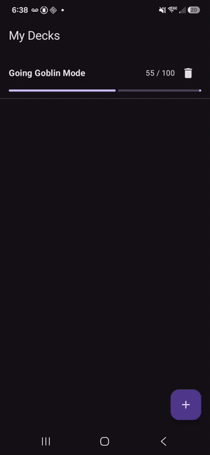
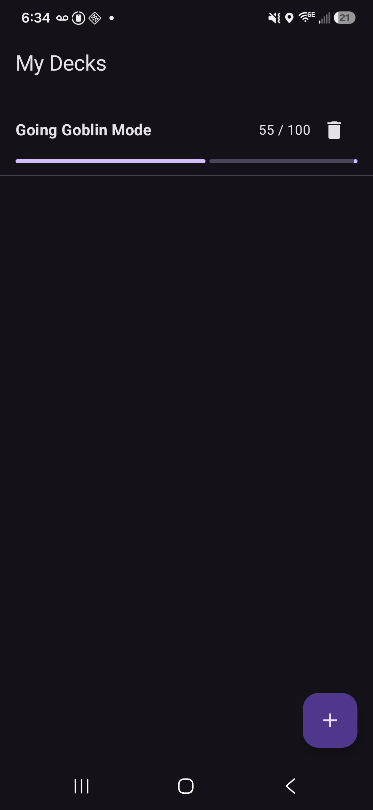
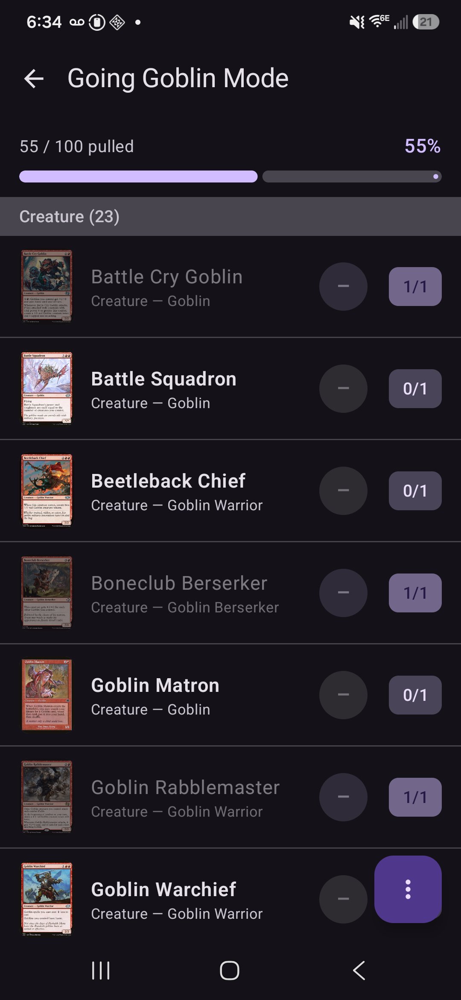
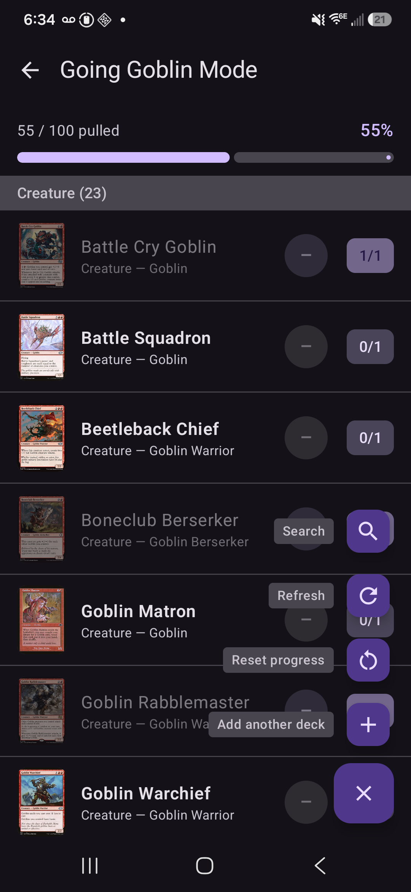

<div align="center">

# 🎴 DeckPuller

### Pull your Magic: The Gathering decks from paper, one card at a time.

Import a deck from [Archidekt](https://archidekt.com), then tap your way through it as you physically pull each card from your collection — with live progress, card images, and everything saved per deck.

<br/>



<br/><br/>

[](https://github.com/tahuffman1s/Deckpuller/actions/workflows/ci.yml)
[](#)
[](#)
[](#)
[](#)
[](#)
[](LICENSE)

</div>

---

## ✨ What it does

Building a physical MTG deck from a list is tedious — you scan a decklist, hunt through binders, and lose your place. **DeckPuller** turns that into a tap-to-track checklist:

- Pull a deck straight from **Archidekt** (paste a URL, or browse your own decks by username).
- Cards are shown in one flat A–Z list with their real art (via **Scryfall**).
- Tap a card to mark one pulled; the progress bar and per-card counters update instantly.
- Everything is saved locally, **per deck**, so you can stop and resume anytime.
- Finish a deck and you get a little confetti moment. 🎉

## 📸 Screenshots

<div align="center">
<table>
<tr>
<td align="center"><b>Your decks</b></td>
<td align="center"><b>Pulling a deck</b></td>
<td align="center"><b>Quick actions</b></td>
</tr>
<tr>
<td></td>
<td></td>
<td></td>
</tr>
</table>
</div>

## 🚀 Features

- **📚 Multiple decks** — keep as many decks as you like, each with its own saved pull progress.
- **🔗 Import from Archidekt** — paste a deck URL, or enter your Archidekt username and pick from your public decks (the username is remembered).
- **🖼️ Real card images** — fetched and cached from Scryfall; tap any card to see it full-size.
- **🔤 Flat A–Z list** — one alphabetical list of every card, with a Niagara-style fisheye letter rail (and a floating letter bubble that tracks your thumb) for fast scrolling.
- **➕ Tap or hold** — tap a card or its `+` to pull one; press-and-hold `+`/`−` to repeat. Each card shows a progress meter instead of a raw count.
- **🔎 Search** — the search button in the top bar filters the deck by card name; the keyboard pops up instantly.
- **🗂️ Filter by category** — narrow the list to a single subtitle (Archidekt category / type) from the speed dial.
- **🔄 Pull-to-refresh** — drag down to re-sync a deck from Archidekt **without losing your pulled progress**.
- **♻️ Reset** — zero-out a deck's progress (with a confirmation), ready for the next build.
- **💾 Offline-friendly progress** — pull counts live in a local database and survive restarts.
- **🎉 Completion celebration** — confetti when a deck hits 100%.
- **🌙 Modern Material 3 UI** — edge-to-edge, dark-theme-first, with a left-anchored speed-dial action button.
- **⬆️ In-app auto-update** — checks GitHub Releases on launch (via the rate-limit-free `releases/latest` redirect) and installs new versions for you ([details](docs/AUTO_UPDATE.md)).

## 🧭 How pulling works

1. **Add a deck** from the deck list (the `+` button) — by URL or by browsing your Archidekt username.
2. DeckPuller fetches the decklist from Archidekt and enriches each card with art/type data from Scryfall.
3. On the **pull screen**, tap a card row (or its `+`) to increment its pulled count; hold `+`/`−` to repeat, and the `−` to back one out.
4. The condensed top bar shows the deck name with overall `pulled / total · %`, plus a slim progress bar; each card has its own progress meter.
5. Pull everything and enjoy the confetti — the deck stays in your list at 100% for next time.

The **search** button sits in the top bar, **pull-to-refresh** re-syncs the deck, and the left-anchored **speed-dial** holds Filter and Reset so the card list stays clean.

## 🏗️ Architecture & tech stack

DeckPuller is a single-module Android app following an MVVM + repository pattern with a clear data / domain / ui split.

| Layer | What's there |
|-------|--------------|
| **UI** | Jetpack Compose (Material 3), Navigation-Compose, screen-scoped `ViewModel`s exposing `StateFlow` |
| **Domain** | Plain Kotlin models (`Deck`, `DeckCard`, `DeckSummary`) and version comparison |
| **Data** | Repository over Retrofit APIs + a Room database; DataStore for preferences; Coil for images |

**Built with:**
- **Kotlin 2.0** · **Jetpack Compose** (Material 3) · **Navigation-Compose**
- **Hilt** for dependency injection
- **Room** for local persistence (decks + per-card progress)
- **Retrofit + kotlinx.serialization** for the Archidekt & Scryfall APIs
- **Coil** for card image loading/caching
- **DataStore (Preferences)** for the saved Archidekt username
- **Coroutines / Flow** throughout
- **konfetti** for the completion celebration
- **Robolectric · JUnit4 · Turbine · MockK** for tests

### Project layout

```
app/src/main/java/com/deckpuller/
├── data/
│   ├── remote/      # Archidekt + Scryfall APIs and DTOs
│   ├── local/       # Room database, DAO, entities
│   ├── repository/  # DeckRepository (import, refresh, reset, search…)
│   ├── prefs/       # DataStore-backed UserPreferences
│   └── image/       # Coil image prefetcher
├── domain/          # Models, version comparison
├── ui/
│   ├── decklist/    # "My Decks" home
│   ├── importdeck/  # Add-deck (URL + username browse)
│   ├── pull/        # Pull screen, card rows, celebration
│   └── theme/
└── di/              # Hilt modules
```

## 🛠️ Building & running

**Requirements:** Android Studio (Ladybug or newer), JDK 17, Android SDK 35.

```bash
# Clone
git clone git@github.com:tahuffman1s/Deckpuller.git
cd Deckpuller

# Build a debug APK
./gradlew :app:assembleDebug

# Install on a connected device / emulator
./gradlew :app:installDebug

# Run the unit test suite (Robolectric)
./gradlew :app:testDebugUnitTest
```

Or just open the project in Android Studio and hit **Run**.

## 🔁 CI / CD

GitHub Actions runs two pipelines:

- **CI** — on every push/PR to `main`: Android Lint → unit tests → debug APK, with the APK and test/lint reports uploaded as artifacts.
- **Release** — on a `v*` tag (or manual dispatch): builds a **signed** release **APK + AAB** and publishes a GitHub Release with auto-generated notes.

Cut a release by tagging:

```bash
git tag v1.0.0 && git push origin v1.0.0
```

See **[docs/RELEASING.md](docs/RELEASING.md)** for the one-time signing-secret setup and full details.

## 🔌 Data sources

- **[Archidekt](https://archidekt.com)** — deck lists, via its public (unofficial) API.
- **[Scryfall](https://scryfall.com)** — card metadata and images.

> **Note on Archidekt accounts:** Archidekt has no official OAuth for third-party apps, so DeckPuller can only browse your **public** decks (by username) — there's no login and private decks aren't accessible. You can always import any deck directly by URL.

Please be kind to these free community APIs. DeckPuller is an unofficial fan project and isn't affiliated with Archidekt, Scryfall, or Wizards of the Coast.

## 📄 License

Released under the [MIT License](LICENSE).

<div align="center">
<sub>Magic: The Gathering is © Wizards of the Coast. DeckPuller is an unofficial, non-commercial fan tool.</sub>
</div>
